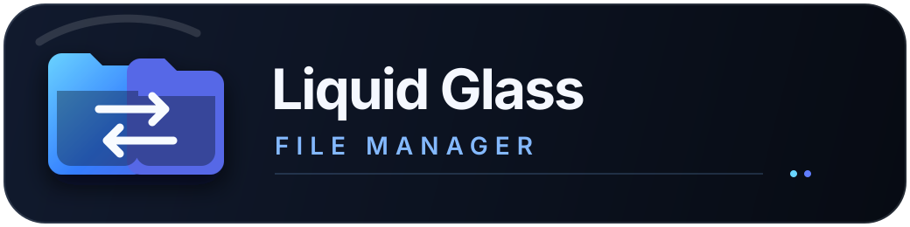

<p align="center">
  
</p>

# Liquid Glass File Manager

[](https://github.com/robikorb/liquid-glass-file-manager/actions/workflows/ci.yml)
[](LICENSE)

Docker-first dual-pane file manager with a dark smoked-glass interface. Mount
only the folders and disks you want the application to see, then browse, copy,
move, rename, edit, preview, and delete files from a browser.

The backend is written in Go, the frontend uses React and TypeScript, and the
complete UI is embedded into one container image. Application state is stored
in SQLite inside a persistent Docker volume.

## Features

- Authenticated single-user web interface with Argon2id password hashing.
- Dual-pane list and grid browsing.
- Dedicated item selectors plus Cmd/Ctrl+click, Shift+click, and Cmd/Ctrl+A
  multiple selection.
- Batch copy and move jobs with combined byte and file progress.
- Complete transfer traversal that is independent of hidden-file display
  preferences and UI listing limits.
- Skip, replace, rename, and apply-to-all conflict handling.
- Permanent batch deletion with an explicit confirmation dialog.
- Safe single-item rename without overwriting an existing destination.
- Monaco-based editor for bounded UTF-8 text and code files.
- Image thumbnails, media preview, text preview, favorites, and recent folders.
- Server-enforced read-only volumes.
- Non-root container process with configurable PUID, PGID, and umask.
- Persistent jobs and automatic forward-only SQLite migrations.
- Backup and update scripts that preserve settings.

## Quick start

Requirements: Docker Engine or Docker Desktop and Docker Compose v2.

```bash
git clone https://github.com/robikorb/liquid-glass-file-manager.git
cd liquid-glass-file-manager
./setup.sh
```

`setup.sh`:

1. creates a local `.env`;
2. asks for the initial administrator name and password;
3. writes the credentials into gitignored, mode `0600` secret files;
4. creates a disposable example volume configuration;
5. builds and starts the stack;
6. waits for the readiness check.

The default interface is available at
[http://127.0.0.1:3002](http://127.0.0.1:3002). Change `LGFM_PORT` in `.env`
before startup if that port is already in use.

The default bind address is `127.0.0.1`. For trusted LAN or VPN access, set
`LGFM_BIND_ADDR=0.0.0.0` explicitly and protect the service with host firewall
rules. Prefer an HTTPS reverse proxy and set `LGFM_SECURE_COOKIE=true`.

The password is never baked into the image or committed to Git. On startup it
is hashed with Argon2id before being stored in SQLite.

## Adding storage

Storage access requires both:

1. a Docker bind mount in the local `compose.override.yml`;
2. a matching entry in `config/volumes.yaml`.

Start every real disk or network share as read-only:

```yaml
services:
  file-manager:
    volumes:
      - type: bind
        source: /path/on/the/host
        target: /mnt/volumes/media
        read_only: true
```

```yaml
volumes:
  - id: media
    name: Media
    path: /mnt/volumes/media
    readOnly: true
    showHiddenFiles: false
    thumbnails: true
```

After read-only browsing and preview tests pass, remove `read_only: true` from
the Docker mount and change the registry entry to `readOnly: false`. See
[docs/STORAGE-MOUNTS.md](docs/STORAGE-MOUNTS.md) for the complete procedure.

`compose.override.yml`, `config/volumes.yaml`, `.env`, credentials, and backups
are local and gitignored. Updating the application does not replace them.

## Updating without losing settings

```bash
./scripts/update.sh
```

The updater stops the app briefly, creates a backup, fast-forwards the Git
checkout, rebuilds the image, recreates the container, and verifies readiness.
The stable Docker volume `liquid-glass-file-manager_app-state`, local `.env`,
credentials, and volume configuration are preserved.

Never run `docker compose down -v` unless you intentionally want to delete the
application database. Mounted user files are never stored in the application
state volume. See [docs/UPGRADING.md](docs/UPGRADING.md).

## Safety model

- Browser requests contain a configured volume ID and relative path, never an
  unrestricted host path.
- Absolute paths, traversal, nested roots, and symlink traversal are rejected.
- Read-only capability is enforced by the backend for every mutation.
- Copy and move jobs use unmistakable partial names and verify files before the
  final rename.
- Transfers enumerate every source entry, including dotfiles, and never inherit
  the browser's hidden-file filter or 10,000-item display cap.
- Batch jobs run serially instead of starting hundreds of concurrent copies.
- The volume root can never be deleted.
- Every recursive deletion path, including conflict replacement and
  cross-filesystem move cleanup, never follows symlinks and refuses nested
  filesystem boundaries.
- Editor writes are size limited, conflict checked, and atomically replaced.

This application exposes whatever storage the operator mounts. Do not mount the
Docker socket, block devices, the host root, or sensitive folders that users
should not access. Prefer LAN, VPN, or Tailscale access. If a reverse proxy
provides HTTPS, set `LGFM_SECURE_COOKIE=true`.

## Documentation

| Document | Purpose |
|----------|---------|
| [docs/INSTALL.md](docs/INSTALL.md) | Installation, credentials, environment, and health |
| [docs/USER-GUIDE.md](docs/USER-GUIDE.md) | Selection, copy, move, delete, rename, editor, and previews |
| [docs/STORAGE-MOUNTS.md](docs/STORAGE-MOUNTS.md) | Adding local disks and network shares safely |
| [docs/TRANSFERS.md](docs/TRANSFERS.md) | Durable batch jobs, progress, conflicts, cancellation |
| [docs/UPGRADING.md](docs/UPGRADING.md) | Backup, update, migration, and rollback |
| [docs/OPERATIONS.md](docs/OPERATIONS.md) | Troubleshooting and unavailable mounts |
| [docs/SECURITY.md](docs/SECURITY.md) | Threat model and enforced boundaries |
| [docs/AUTH.md](docs/AUTH.md) | Authentication, sessions, and CSRF |
| [docs/API.md](docs/API.md) | HTTP API |
| [docs/ARCHITECTURE.md](docs/ARCHITECTURE.md) | Components and runtime design |
| [docs/KEYBOARD.md](docs/KEYBOARD.md) | Keyboard and selection shortcuts |
| [docs/RELEASE-TEST.md](docs/RELEASE-TEST.md) | Clean-install release acceptance test |
| [docs/PRODUCT-ROADMAP.md](docs/PRODUCT-ROADMAP.md) | Public-launch priorities and rebrand proposal |
| [CHANGELOG.md](CHANGELOG.md) | Release history |
| [CONTRIBUTING.md](CONTRIBUTING.md) | Development and pull-request rules |
| [SECURITY.md](SECURITY.md) | Private vulnerability reporting policy |

## Development

```bash
cd frontend
npm ci
npm run lint
npm run build

cd ../backend
go test ./...
go vet ./...
```

Automated tests use temporary directories and disposable fixtures only. Never
point tests at real user storage.

Pull requests run the same backend, frontend, Compose, and container build
checks in GitHub Actions. See [CONTRIBUTING.md](CONTRIBUTING.md).

## License

Licensed under the [MIT License](LICENSE).
