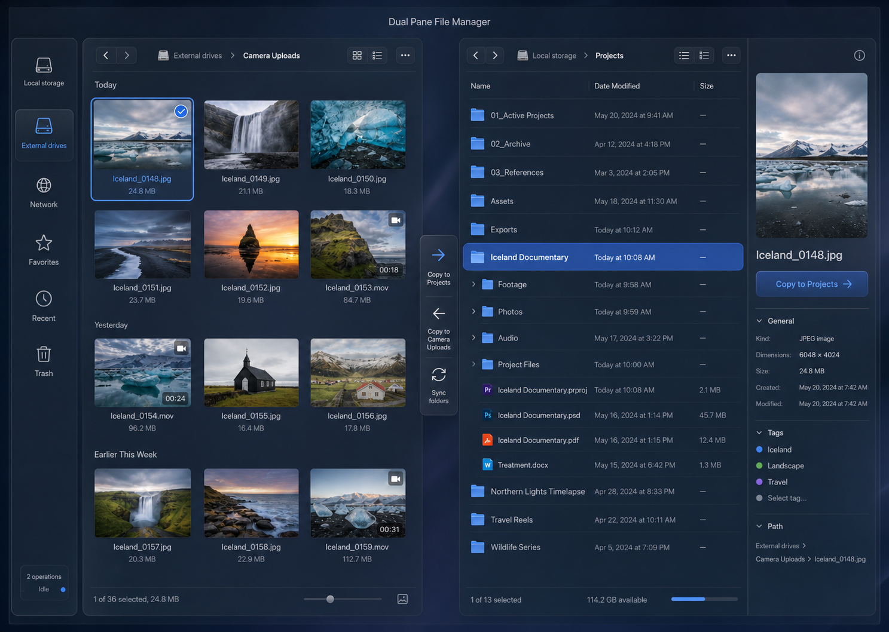

# Architecture direction

## Distribution

The project should publish one application container with multi-platform
manifests for:

- `linux/amd64`
- `linux/arm64`

Operators should configure storage with bind mounts or named volumes. The same
image should run without source changes on Docker Engine, Docker Desktop, common
NAS platforms, and Linux guests hosted by Proxmox.

The application manages only storage explicitly mounted into the container. It
must not mount arbitrary host paths itself and must not require access to the
Docker socket.

## Runtime shape

Use a single runtime container:

```text
Browser
  -> Go HTTP server
       -> compiled React application
       -> authenticated filesystem API
       -> preview and thumbnail service
       -> transfer event stream
       -> configured storage roots
       -> SQLite application state
```

Keep deployment simple. Add external databases, queues, or helper services only
when a measured requirement justifies them.

### Shutdown sequence

`SIGTERM` and `SIGINT` run an ordered shutdown. The ordering is a correctness
requirement, not a nicety:

1. `api.Server.BeginShutdown` closes a broadcast channel that long-lived
   streaming handlers select on. `http.Server.Shutdown` waits for connections to
   become idle and does **not** cancel request contexts, so a handler that
   blocks forever — the transfer event stream — must be told to return. Without
   this step the HTTP shutdown consumes its entire deadline.
2. `http.Server.Shutdown` drains in-flight requests.
3. `transfer.Manager.Shutdown` cancels workers and waits for them.

Steps 2 and 3 take **independent** contexts. A shared deadline lets a slow HTTP
drain starve the transfer cleanup, which is what turns a controlled stop into
orphaned staging files and jobs stuck in Running. Their sum must stay below the
Compose `stop_grace_period`; both constants live in
`backend/cmd/server/main.go`.

Any future long-lived handler (websockets, log tailing, progress streams) must
select on the same shutdown signal.

## Storage configuration

Each mount should have:

- stable internal ID;
- display name;
- container path;
- read-only or read-write capability;
- optional hidden-file policy;
- optional thumbnail policy.

The frontend works with internal volume IDs and relative paths. It must not know
or reconstruct host paths.

See `STORAGE-MOUNTS.md` for host examples and the expected copy and move
semantics.

Mount metadata is loaded from a read-only YAML configuration file. Docker bind
mounts alone are not treated as application authorization. At startup the
backend validates that:

- volume IDs are unique and stable;
- configured paths are absolute container paths below `/mnt/volumes`;
- configured roots exist and are directories;
- nested or overlapping roots are rejected unless a future design explicitly
  supports them;
- the declared read-only capability agrees with an actual write probe only when
  the operator explicitly enables that startup check.

The validated registry is immutable for the lifetime of the process. Changing
mounts requires a controlled container restart.

## Authentication

The first release is a single-user application, but it must still be
authenticated before any filesystem metadata is returned.

- Bootstrap the administrator with a username and a password secret supplied by
  the operator.
- Read the password from a Docker secret or file, not a command-line argument.
- Hash the password with Argon2id before storing application state.
- Use an opaque server-side session with a short-lived, HTTP-only cookie.
- Store only a one-way digest of the browser session token in SQLite.
- Set `SameSite=Strict`; set `Secure` whenever the public URL uses HTTPS.
- Require CSRF protection and same-origin validation for every state-changing
  request.
- Rate-limit failed login attempts.
- Never log passwords, session tokens, absolute host paths, or file contents.

The application should support deployment behind a trusted HTTPS reverse proxy.
It must not claim that plain HTTP is safe outside an isolated development
environment.

## API boundary

The backend owns authorization and filesystem safety. Disabling a UI control is
not a security boundary.

Phase 0 endpoints cover:

- service health and readiness;
- login, logout, and current-session state;
- configured volume discovery;
- directory listing;
- file metadata;
- streamed download with range support.

Phase 1 adds durable **copy** transfer jobs (SQLite state machine, staging
files, conflict policies, cancellation, SSE progress, startup reconcile).
Phase 2 adds **move** (atomic rename attempt, verified cross-filesystem
copy-then-delete, accurate partial-success reporting). Transfer jobs accept up
to 500 selected sources, process them serially, and publish aggregate progress.
Phase 3 adds **safe
thumbnails**, **ranged media preview**, **favorites / recent / pane
persistence**, keyboard navigation, same-folder rename, and a bounded,
optimistic-concurrency text editor. Permanent batch deletion adds prevalidation,
explicit confirmation, root protection, no symlink traversal, and nested-mount
refusal. All filesystem APIs use the same
volume-ID and relative-path security model. See `API.md`, `TRANSFERS.md`,
`KEYBOARD.md`, and `OPERATIONS.md`.

Recursive transfer planning happens in the worker after the job is persisted,
so a large or slow source tree does not hold the create request open. Transfer
enumeration is intentionally separate from display listing: it includes
dotfiles and is never capped by the browser's 10,000-entry safety limit.

Thumbnail and preview endpoints process untrusted files with input-size,
decoded-pixel, execution-time, and concurrency limits before returning bytes.

## Path resolution

String cleaning is not a sufficient filesystem boundary. Every filesystem
endpoint must call one shared resolver that starts from the configured volume
root and resolves path components without escaping that root.

The runtime container is Linux even when Docker runs on macOS or Windows. Use a
directory-descriptor-based implementation such as `openat2` with beneath and
no-magic-link restrictions when available, with a tested fail-closed fallback.
Do not check a path and then reopen it through a separate unrestricted absolute
path. Symlinks may be listed as entries in the first phase, but the application
must not traverse them.

## File operations roadmap

### Phase 1 (copy) — implemented

- Persistent SQLite transfer-job state machine
- SQLite WAL mode with bounded busy waits and batched durable progress writes
- Destination-side staging (`.lgfm-partial-<job-id>`), verify, atomic rename
- Progress, speed, remaining bytes, cancellation, conflict policies
- Server-Sent Events with client reconnect + REST snapshot
- Startup reconcile of interrupted jobs (never false success)
- Recursive directory copy without symlink traversal
- Complete source enumeration independent of display filters and listing caps
- Best-effort free-space reporting (unknown must not fail or claim sufficiency)
- Server-side rejection of writes to read-only volumes
- One to 500 selected sources per durable job, serial processing, aggregate
  progress, and apply-to-all conflict policy

### Phase 2 (move) — implemented

- Atomic same-filesystem rename attempted first (not inferred from path strings)
- Cross-filesystem fallback only on `EXDEV` / unsupported-operation
- Verified copy-then-delete; source removed only after destination final rename
- Partial success reported as `failed` when source deletion fails after verify
- Failure-injection and restart coverage for move stages
- Move UI enabled; Trash/Sync remain hidden

### Phase 3 (previews and polish) — implemented

- Safe image thumbnails with byte, pixel, time, and concurrency limits
- Inspector image preview + ranged media preview endpoint
- Inspector text/markdown/json/code/docx previews (bounded UTF-8 / zip+XML extract)
- Favorites, recent locations, and persistent dual-pane state (SQLite)
- Keyboard shortcuts for navigation, selection, copy/move, and inspector
- Listing truncation for huge directories; unavailable-mount probing and UI retry
- Same-folder no-replace rename and a lazy-loaded, locally bundled Monaco editor
- Atomic UTF-8 saves with a 2 MiB ceiling and stale-file conflict detection
- Operator notes in `OPERATIONS.md`; shortcut reference in `KEYBOARD.md`

### Upload — implemented

One HTTP request per file, streamed straight to disk. A multipart batch would
buffer server-side, hide per-file progress, and make cancellation all-or-nothing.

- destination-side `.dirdeck-upload-*` staging file promoted by a single rename;
- `Content-Length` mismatch is a failure, never a short file under the real name;
- `RENAME_NOREPLACE` unless the caller explicitly asked to replace;
- free-space check before the first byte is written;
- orphaned staging files swept when the folder is next used as a destination.

The server has no overall read deadline, because a fixed one would kill long
uploads mid-transfer. `ReadHeaderTimeout` still bounds slow-header attacks.

Folder upload walks the dropped tree in the browser and sends one request per
file with its relative directory. `readEntries` returns a bounded batch and must
be called until it yields nothing; a single call silently truncates large folders,
which for an upload means quietly losing files. Directory creation is
component-by-component through the same validated `Mkdir`, so there is no second
path into the filesystem to secure.

Resumable chunked upload remains deferred. It needs a server-side session, an
offset protocol, and orphan expiry — a meaningful amount of state for a feature
that plain retry already covers.

### Permanent delete — implemented

- One to 500 selected paths with explicit confirmation
- Full-batch prevalidation before the first removal
- Duplicate removal and selected-descendant collapse
- No volume-root deletion, symlink traversal, or nested-filesystem crossing
- Clear documentation that deletion is permanent and not transactional

Trash remains a later capability. If added, it must be capability-aware and
must never silently become permanent deletion.

## Frontend structure

The selected primary screen contains:

- a single locations sidebar;
- independent left and right pane state;
- thumbnail and list view modes;
- directional transfer controls;
- optional inspector;
- operation status area.

The sidebar stacks Volumes, Favorites, and Recent as independently collapsible
sections. An earlier design put a 72px icon rail beside it whose only job was
switching which of the three the panel showed. In a dual-pane manager horizontal
space is the scarcest resource, so a navigation level that costs a permanent
column to choose between three lists does not pay for itself — all three are now
visible at once. Do not reintroduce a mode switch here; add sections instead.

Keyboard navigation, focus management, selection behavior, and drag and drop
must be treated as product features, not visual polish.

The visual concept shows future Trash and Sync locations. Hide those entries
until their capabilities are implemented. Do not ship decorative controls that
suggest destructive or synchronization behavior that does not exist.

Both panes must support list and grid modes independently. The inspector is
collapsible and should default closed when horizontal space is limited.
Both views virtualize their visible window with overscan so a 10,000-entry
directory does not create 10,000 live rows or cards.

### Virtualization contract

Row virtualization positions spacer elements arithmetically, so **every row must
be exactly the height the code assumes**. Four constants in `App.tsx` are
duplicated in `index.css` and must be changed together:

| `App.tsx` | `index.css` | Meaning |
|-----------|-------------|---------|
| `ROW_HEIGHT[density]` | `--list-row-height` | List row height, written from JS |
| `GRID_ROW_HEIGHT` | `.grid-item` height + `.grid` gap | Grid row pitch |
| `GRID_MIN_COLUMN_WIDTH` | `.grid` `minmax()` first value | Column breakpoint |
| `GRID_GAP` | `.grid` gap | Column and row gap |

Row height is the density setting, so it cannot be a constant in two places.
`App.tsx` owns `ROW_HEIGHT` and writes it to the `--list-row-height` custom
property; CSS reads that variable and the virtualization arithmetic uses the same
number. Never hard-code a row height in the stylesheet again.

A cell that can grow breaks this silently: the list looked correct until a long
filename wrapped, after which the scroll offset drifted further with every row.
The list therefore uses `table-layout: fixed`, fixed date and size column
widths, and clips the name with an ellipsis rather than wrapping it. Do not add
a list cell with variable height, and do not remove the clipping without also
making the row height dynamic.

## Theme direction

Both themes are one token set. `:root` carries dark, a `prefers-color-scheme:
light` rule carries light for users who have not chosen, and `data-theme` on the
root element lets an explicit choice win in either direction. Every surface reads
tokens — no component hard-codes a colour — which is what makes a second theme a
palette change rather than a rewrite.

Both light blocks — the `prefers-color-scheme` one and the explicit
`data-theme='light'` one — must carry an identical declaration set. They are
separate rules because one applies by preference and the other by choice, and a
token present in only one of them silently falls back to the dark value. That is
exactly how the first attempt shipped dark dialogs to light-theme users.

Only the Monaco editor window keeps hard-coded colours, deliberately: it is themed
in `EditorModal.tsx` and a light editor needs a matching Monaco theme. Everything
else reads tokens, which is verifiable by scanning the stylesheet outside the token
blocks.

Accent colour needs two tokens. `--accent` is for fills, borders, and focus
rings; `--accent-text` is the lighter value used when the accent is text, because
the fill colour measures 4.30:1 on `--bg-panel-strong` and fails AA. Contrast for
every text token on both panel surfaces, plus the filled button, is verifiable
from the stylesheet; the current worst case is 5.17:1.


Use dark smoked-glass surfaces over a restrained blue and graphite backdrop.
Create glass through translucency, blur, subtle inner highlights, and fine
separators. Keep text contrast accessible. Avoid excessive pills, glow, large
shadows, and decorative cards.

The original visual direction is retained as a design reference:



## Repository and release quality

The repository includes a contribution guide, security-reporting policy, code
of conduct, architecture, changelog, clean-install acceptance test, and
documented backup/update/rollback process.

The repository includes CI for Go tests/vet, frontend lint/build, Compose
validation, and the container build.

Before a stable public release, repository automation should additionally add:

- dependency and container scanning;
- SBOM generation;
- multi-platform amd64/arm64 image publication;
- signed release images and immutable version tags;
- architecture decision records for later breaking changes.
